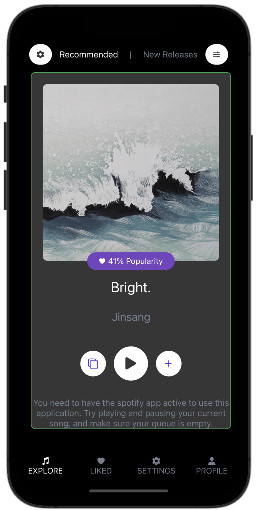
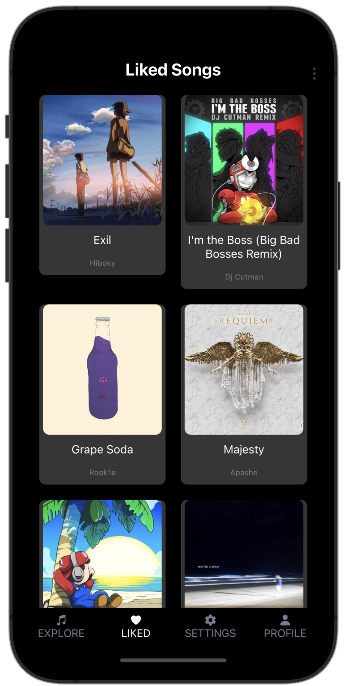
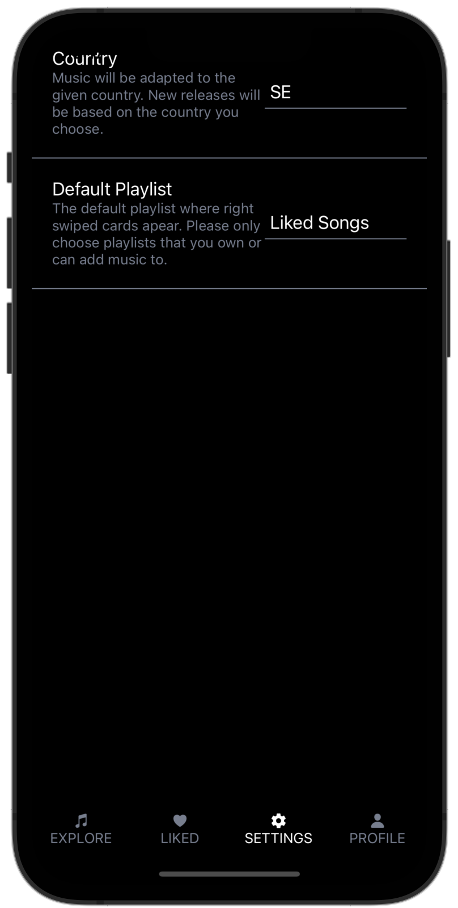
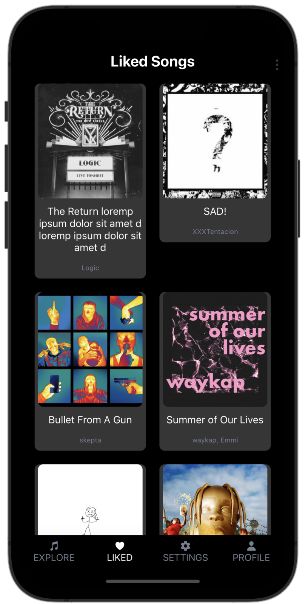
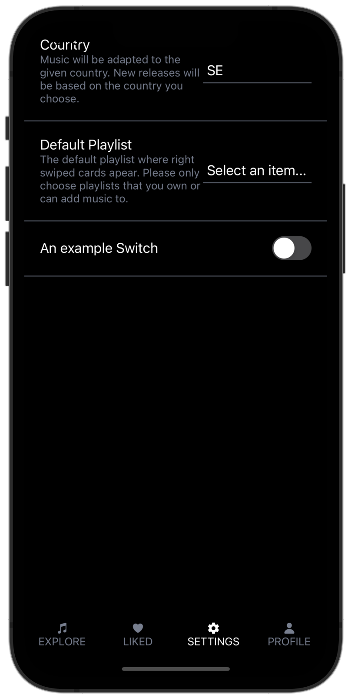

# Swiperr
## About
Swiperr is a platform for discovering new music with a mix of your favorite types of songs mixed with music you did not know you wanted, and needed. The app is connected to spotify so all you have to do is fire up spotify and start using Swiperr. With the familiar card-swiping functionality you can add the songs to your spotify library or the playlist where you feel it fits best.
## Showcase
### Spotify Data

    
    
    
    

### Mock Data
The app can also be used without logging in

    
    
    
    

## How to run
1. Clone the repo and navigate into the folder
2. Make sure node and [npm](https://docs.npmjs.com/downloading-and-installing-node-js-and-npm) is installed.
3. Install yarn with `npm i -g yarn`
4. Install expo-cli with `npm i -g expo-cli`
5. Run `yarn` to install package dependencies
6. Signup for [spotify developer](https://developer.spotify.com/dashboard/) and create a new project
7. Create a `.env` file next to the `.env.example` and place your client id and client secret into it (given from the spotify developer project)
8. Make sure your redirect URIs match the ones in .env file. Theese redirect URIs may vary (tested on MacOS; known issues with WSL 2). To find theese uris you can run `yarn start` in the project root showing the the URI to the phone. By pressing `w` you can view the web URI. The example URIs are most common and standard for MacOS. 
9.  Inside the project, add two redirect URIs by pressing edit settings followed by add redirect URI. Paste `exp://localhost:19000/` (Phone) and `http://localhost:19006/` (Web). Or the corresponding URI found in step 7. 
10. Run `yarn start` in the terminal to start the app
11. Press `w`, `a`, or `i` to run in web, android or ios (Note: When running in web, rightclick and inspect the site and switch to phone view and refresh the page to make it fit the screen)

## How to use
- When first starting the app it only contains mock data
- To login and fetch Spotify data one can press the login button at the top of the explore screen
- The profile tab is now filled with you spotify profile information
- The explore tab now containst cards with recomendations from spotify. Theese are based on two of your top songs (2 out of top 10), two of your top artists (2 out of top 10) and one genre from your top songs.
- By swiping right on an image you like it and it will appear in your spotify liked songs folder.
- With + you can place the song into a specific playlist. 
- Swiping left moves on to the next song
- You can change various settings in the settings page.

## API and App information
- All non-mock data comes from the [Spotify web API](https://developer.spotify.com/documentation/web-api/). See the [API reference endpoints](https://developer.spotify.com/documentation/web-api/reference/#/) here.
- This is a No Database Application and no user data is stored. 
- This application serves as a extension of the spotify experience with the intent of making it easier and more intuitive to access new music.

*Note: the [avlailible genres](https://developer.spotify.com/documentation/web-api/reference/#/operations/get-recommendation-genres) does not include all spotify genres.*

## Todo
See [issues](https://github.com/ollisco/swiperr/issues) with enhancement labels.

## Problems?
Feel free to post an [issue](https://github.com/ollisco/swiperr/issues)
